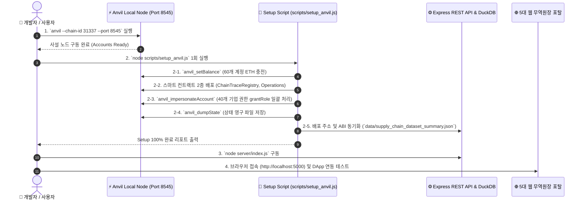

# 🛠️ ChainTrace: Anvil + 치트코드 RPC 기반 1회성 Setup & DApp 연동 제안서

---

## 📌 1. 제안 개요 (Overview)

본 제안서는 **Hardhat Node 대신/병행하여 Foundry의 Anvil 사설 노드를 구동**하고, **치트코드(Cheatcode) RPC API (`anvil_setBalance`, `anvil_impersonateAccount`, `anvil_setCode` 등)**가 작성된 **1회성 Setup 스크립트**를 실행하여 40개 참여 기업의 지갑 권한 및 초기 공급망 스마트 컨트랙트 상태를 순식간에 빌드한 후, 5대 무역원장 웹 포탈(DApp) 및 REST API 백엔드와 연동하는 전체 아키텍처 및 구현 계획입니다.

> [!IMPORTANT]
> 본 단계에서는 **코드를 직접 수정하거나 작성하지 않으며**, 사용자의 명확한 승인("진행해")을 받은 이후 순차적으로 구축을 진행합니다.

---

## 📥 2. Foundry (Anvil / Forge) 윈도우(Windows) 설치 가이드

Windows 환경에서 Foundry(Anvil/Forge)를 설치하는 2가지 최적 가이드입니다.

### 방법 A: Cargo (Rust) 기반 설치 (권장)
```powershell
# Cargo로 anvil 및 forge 바이너리 빌드/인스톨
cargo install --git https://github.com/foundry-rs/foundry --bin anvil --locked
cargo install --git https://github.com/foundry-rs/foundry --bin forge --locked
```

### 방법 B: Foundryup 공식 바이너리 설치 (Git Bash / PowerShell)
```powershell
# 1. Foundryup 설치 스크립트 실행
curl -L https://foundry.paradigm.xyz | bash

# 2. foundryup 실행하여 최신 anvil / forge 바이너리 설치
foundryup
```

---

## 🏗️ 3. 전체 시스템 작동 워크플로우 (Architecture & Workflow)



---

## ⚡ 4. Anvil 특화 치트코드(Cheatcode) RPC API 활용 계획

`scripts/setup_anvil.js` 또는 `script/Setup.s.sol`에서 사용할 핵심 Anvil RPC 메소드입니다:

| RPC API 메서드 | 용도 및 이점 |
| :--- | :--- |
| **`anvil_setBalance`** | 60개 지갑 계정에 즉시 100,000 ETH 잔액 충전 (가스비 고갈 원천 차단) |
| **`anvil_impersonateAccount`** | 비설정 지갑이나 관리자 계정의 개인키(PrivateKey) 없이도 서명 트랜잭션 전송 (`grantRole`, `registerParticipant` 1초 내 일괄 수록) |
| **`anvil_stopImpersonatingAccount`** | 가장(Impersonate) 세션 안전 종료 |
| **`anvil_setCode`** | 필요시 스마트 컨트랙트 바이트코드를 특정 주소에 직접 주입 |
| **`anvil_dumpState` / `anvil_loadState`** | Anvil 노드가 종료된 후 재시작되더라도 컨트랙트 배치 상태를 파일(`anvil_state.json`)로 영구 저장 및 복원 |

---

## 🧪 5. 프론트엔드 / DApp 연동 테스트 시나리오

1. **Anvil 노드 구동**:
   ```bash
   anvil --chain-id 31337 --block-time 1
   ```
2. **1회성 Setup 스크립트 실행**:
   ```bash
   node scripts/setup_anvil.js
   ```
   - 2개 스마트 컨트랙트 배포
   - 40개 기업 지갑 `setBalance` + `grantRole` 자동 처리
   - DuckDB 데이터베이스 초기화 및 308개 배치 색인 동기화
3. **5대 무역원장 웹 포탈 접속 테스트**:
   - `http://localhost:5000/supplier_portal.html` (원료사)
   - `http://localhost:5000/manufacturer_portal.html` (제조사)
   - `http://localhost:5000/inspector_portal.html` (검사기관)
   - `http://localhost:5000/logistics_portal.html` (물류사)
   - `http://localhost:5000/distributor_portal.html` (유통사)

---

## 📋 6. 순차적 순서별 진행 계획 (Roadmap)

- **[Phase 1] 윈도우 환경 Foundry (Anvil) 설치 및 `package.json` 스크립트 등록**
  - `"anvil": "anvil --chain-id 31337"`
- **[Phase 2] 치트코드 RPC API 기반 1회성 Setup 스크립트 (`scripts/setup_anvil.js`) 작성**
- **[Phase 3] Express 백엔드 API & DuckDB 인덱서 Anvil 연동 독립 테스트 (`scripts/test_anvil_setup.js`)**
- **[Phase 4] 5대 무역원장 웹 포탈 DApp 연동 실시간 검증 및 결과 문서 작성**

---

## 📚 관련 명세 문서

- 📄 [스마트 컨트랙트 명세서 (`ChainTrace_SmartContracts_Spec.md`)](file:///c:/apps/ChainTrace/ChainTrace_SmartContracts_Spec.md)
- 📄 [Step 5 유통사 포탈 보고서 (`Step5_Distributor_Portal_Report.md`)](file:///c:/apps/ChainTrace/Step5_Distributor_Portal_Report.md)
