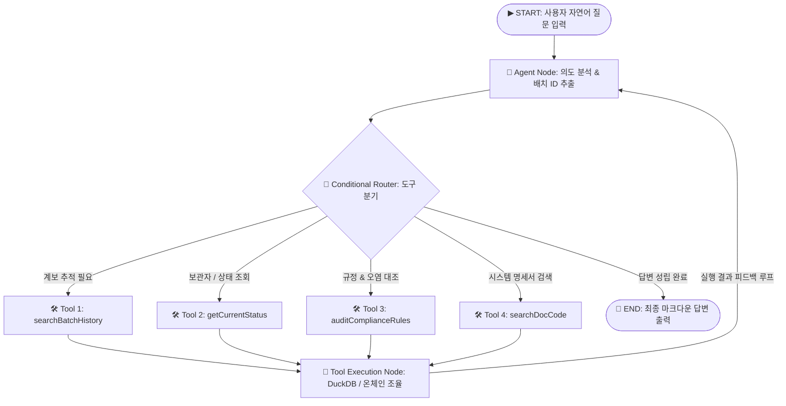
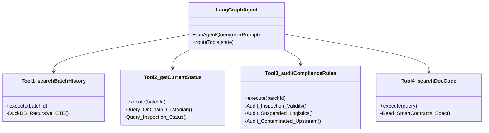
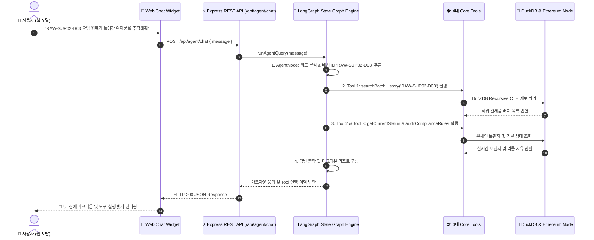

# 📄 ChainTrace: LangGraph JS AI Agent 상태 그래프 아키텍처 상세 명세서

---

## 📌 1. 시스템 개요 (System Overview)

**ChainTrace LangGraph AI Agent**는 무단 변조가 불가능한 **이더리움 스마트 컨트랙트**와 **DuckDB 고속 OLAP 인덱싱 엔진** 상단에서 동작하는 **지능형 순환 상태 그래프(Cyclic State Graph)** 기반의 AI 에이전트입니다.

> [!NOTE]
> 본 에이전트는 **Pure Node.js (`.js`)** 기술 스택 및 `@langchain/langgraph` 상태 그래프 엔진을 준수하며, 사용자의 자연어 질문을 해석하여 적절한 도구(Tools)를 동적으로 선택·실행한 후 최종 결과를 구조화된 마크다운 문서로 답변합니다.

---

## 🏗️ 2. LangGraph 상태 그래프(State Graph) 순환 아키텍처

---

## 🧩 3. 4대 지능형 도구(Core Tools) 상세 명세

### 1) **`Tool 1: searchBatchHistory` (배치 상위/하위 계보 0.001초 재귀 추적)**
- **기능**: 특정 배치 ID(예: `RAW-SUP02-D03`) 입력 시 해당 배치를 원료로 투입한 모든 하위 완제품 배치와 상위 원재료 계보를 **DuckDB Recursive CTE 쿼리**로 0.001초 만에 재귀 탐색합니다.
- **연동 엔진**: DuckDB SQL Engine (`genealogy` 및 `batches` 테이블)

### 2) **`Tool 2: getCurrentStatus` (온체인 실시간 보관자 및 성적서 조회)**
- **기능**: 배치의 온체인 실시간 현재 보관자(`custodian`), 스마트 컨트랙트 수록 최신 상태(`NORMAL`, `QUARANTINED`, `RECALLED`), 최근 공인 검사기관 시험성적서 내역을 조회합니다.
- **연동 엔진**: Ethers.js v6 + DuckDB (`inspections`, `recalls`)

### 3) **`Tool 3: auditComplianceRules` (4대 핵심 규정 및 오염 대조)**
- **기능**: 4대 시스템 규정(① 검사 유효기간 규정 30일/90일 변경, ② 자격 정지 물류사 이관 여부, ③ 상위 계보 오염 원료 포함 여부, ④ 온체인 리콜 발령 여부)을 종합 평가하여 **규정 준수 여부(Compliant / Non-Compliant)**를 자동 진단합니다.
- **연동 엔진**: Compliance Audit Engine

### 4) **`Tool 4: searchDocCode` (시스템 명세서 & 규정 RAG 검색)**
- **기능**: 배치 ID가 명시되지 않은 일반 아키텍처 질의 시, 스마트 컨트랙트 명세서([`ChainTrace_SmartContracts_Spec.md`](file:///c:/apps/ChainTrace/ChainTrace_SmartContracts_Spec.md)) 및 14일치 데이터셋 요약 정답지를 검색하여 시스템 메커니즘을 설명합니다.
- **연동 엔진**: Markdown Document RAG Engine

---

## 🔄 4. 엔드투엔드 대화 처리 시퀀스 (Sequence Flow)

---

## 💻 5. 웹 포탈 대화 위젯 (Chat Widget) 통합 방안

- **위치**: 5개 웹 포탈(원료사, 제조사, 검사기관, 물류사, 유통사) 화면 우측 하단 플로팅 모달
- **추천 원터치 칩**:
  - `🔍 RAW-SUP02-D03 오염 원료 계보 및 완제품 영향 추적`
  - `📜 FG-PACK01-D14 온체인 보관자와 성적서 상태 조회`
  - `🛡️ 스마트 컨트랙트 규정 대조`
- **시각화 유틸리티**: 사용된 도구(`searchBatchHistory`, `getCurrentStatus` 등)를 뱃지 형태(`🛠️ Tool`)로 투명하게 표시

---

## 📚 관련 참조 문서

- 📄 [ChainTrace 제안서 (`ChainTrace_Proposal.md`)](file:///c:/apps/ChainTrace/ChainTrace_Proposal.md)
- 📄 [스마트 컨트랙트 상세 명세서 (`ChainTrace_SmartContracts_Spec.md`)](file:///c:/apps/ChainTrace/ChainTrace_SmartContracts_Spec.md)
- 📄 [Step 6 LangGraph 설계 제안서 (`Step6_LangGraph_Design_Proposal.md`)](file:///c:/apps/ChainTrace/Step6_LangGraph_Design_Proposal.md)
