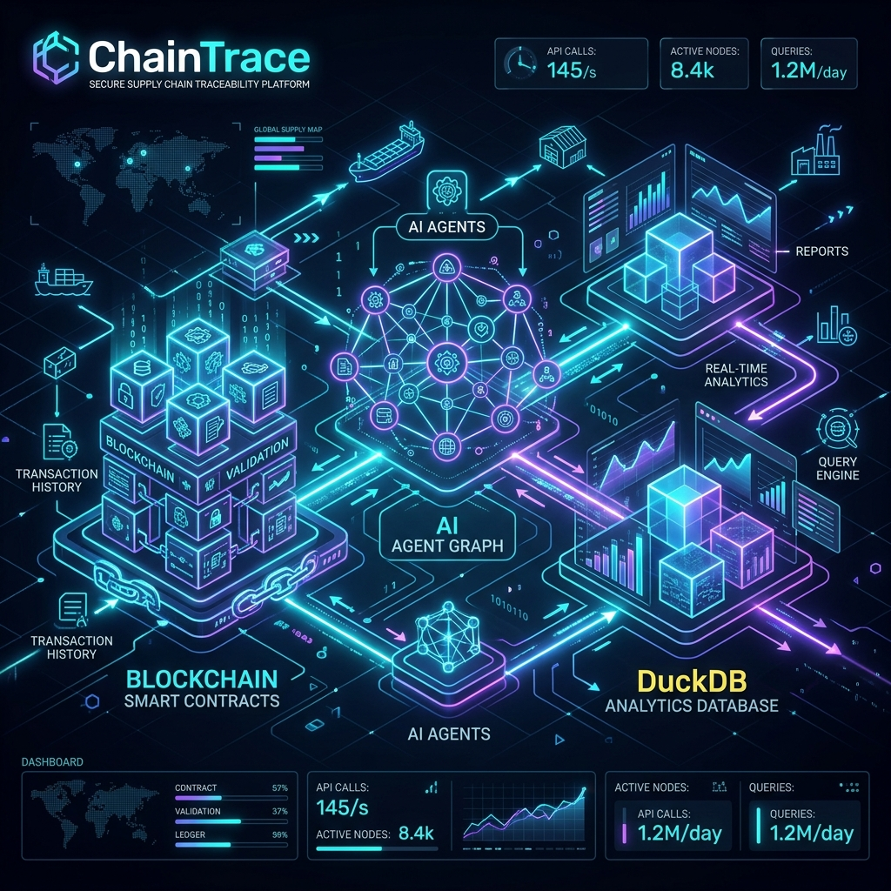
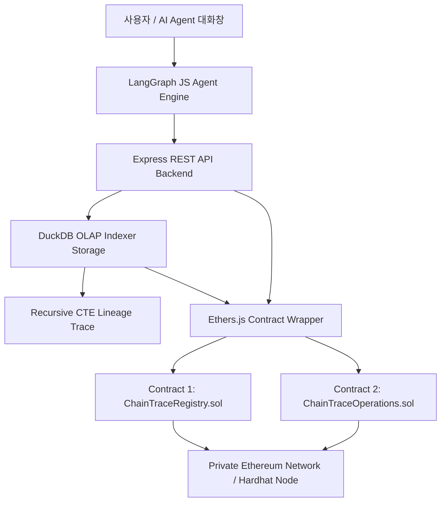

# 🔗 ChainTrace: 블록체인 공급망 이력 관리 & DuckDB + LangGraph AI Agent 시스템



---

## 📌 프로젝트 개요 (Overview)

**ChainTrace**는 원료 공급사, 제조사, 물류사, 검사기관, 유통사 간의 공급망(Raw Material ➔ Manufacturing ➔ Inspection ➔ Logistics ➔ Distribution) 전체 생애주기를 무단 변조가 불가능한 **이더리움 스마트 컨트랙트**에 영구 기록하고, **DuckDB 고속 OLAP 인덱싱 엔진**과 **LangGraph 기반 AI Agent**를 결합하여 이력 추적, 품질 검사 성적서 확인, 현재 보관자 상태 및 규정 대조(Compliance Audit)를 자연어로 간편하게 질의할 수 있는 지능형 공급망 관리 플랫폼입니다.

> [!NOTE]
> 본 프로젝트는 **Pure Node.js (JavaScript - `.js`)** 스택을 준수하며 TypeScript 없이 직관적이고 경량화된 아키텍처로 구현되었습니다.

---

## 🚀 주요 핵심 기능 (Key Features)

1. **스마트 컨트랙트 2종 (Solidity 0.8.28 - EVM Target: Cancun)**
   - [`contracts/ChainTraceRegistry.sol`](file:///c:/apps/ChainTrace/contracts/ChainTraceRegistry.sol): 5대 참여자(원료사, 제조사, 물류사, 검사기관, 유통사) 권한 등록, 원료/완제품 배치 생성 및 상위-하위 계보(Genealogy) 연결
   - [`contracts/ChainTraceOperations.sol`](file:///c:/apps/ChainTrace/contracts/ChainTraceOperations.sol): 인수/인도 이관(Custody Transfer) 요청 및 승인, 검사기관 성적서 서명 수록, 결함 발생 시 리콜(`RECALLED`) 동적 발령 및 유통 차단

2. **DuckDB 고속 OLAP 분석 & Recursive CTE 계보 추적 엔진**
   - 온체인 이벤트(308개 배치, 계보, 성적서, 리콜)를 DuckDB (`data/chaintrace.duckdb`)에 컬럼형 구조로 고속 색인
   - **DuckDB Recursive CTE 쿼리**로 특정 리콜 원료부터 거쳐간 중간재, 최종 오염된 완제품까지 **0.001초 만에 재귀 추적(Recursive Trace)**

3. **14일치 대량 공급망 데이터셋 자동 생성기 (`scripts/generate_dataset.js`)**
   - 40개 참여 기업, 14일간 308개 배치 생성
   - **4대 특수 사건 주입**: Day 5 검사 반려 급증, Day 7 유효기간 규정 변경, Day 9 물류사 자격 정지, Day 11 원료 리콜 발령
   - 고정 난수 시드(`20260811`) 기반으로 AI Agent 검증용 정답지 데이터셋([`data/supply_chain_dataset_summary.md`](file:///c:/apps/ChainTrace/data/supply_chain_dataset_summary.md)) 생성

4. **Express REST API 백엔드 서버 (`server/index.js`)**
   - `GET /api/stats`: DuckDB OLAP 통계
   - `GET /api/participants`: 40개 기업 목록
   - `GET /api/batches`: 전체 배치 목록
   - `GET /api/batch/:id`: 단일 배치 상세 및 실시간 보관자
   - `GET /api/trace/genealogy/:id`: DuckDB 계보 재귀 추적 API

5. **🌐 회사별 독립 웹 무역원장 포탈 & 결함 시나리오 처리 (Step-by-Step Portals)**
   - **Step 1 [원료 공급사 포탈]** ([`public/supplier_portal.html`](file:///c:/apps/ChainTrace/public/supplier_portal.html)): 1차 원료 생산 수급 등록, 온체인 서명 수록 및 디지털 무역원장 전자증명서 카드 실시간 발급
   - **Step 2 [제조사 포탈]** ([`public/manufacturer_portal.html`](file:///c:/apps/ChainTrace/public/manufacturer_portal.html)): 상위 원료 계보(Genealogy) 연결 완제품 생산, **🚨 리콜/격리 원료 투입 사전 차단 (`400 Bad Request`)**, **🚨 자사 완제품 온체인 자발적 리콜 발령**
   - **Step 3 [검사기관 포탈]** ([`public/inspector_portal.html`](file:///c:/apps/ChainTrace/public/inspector_portal.html)): 5개 공인 검사기관 시험성적서(IPFS) 서명 수록, **🚨 검사 불합격(FAILED) 등록 시 온체인 상에서 배치 상태 자동 격리(`QUARANTINED`) 및 유통 차단**
   - **Step 4 [물류사 포탈]** ([`public/logistics_portal.html`](file:///c:/apps/ChainTrace/public/logistics_portal.html)): 제조사 ➔ 물류사 소유권 이관 요청/수락 서명, 콜드체인 운송 메모 수록, **🚨 격리/리콜 배치 물류 이관 신청 사전 차단 (`400 Bad Request`)**
   - **Step 5 [유통사 포탈]** ([`public/distributor_portal.html`](file:///c:/apps/ChainTrace/public/distributor_portal.html)): 물류사 ➔ 유통사 매장 최종 입고 수락, 매장 재고 현황 및 **🚨 상위 계보 오염 실시간 온체인 리콜 모니터링 & POS 판매 자동 차단 뷰어**

---

## 🏗️ 시스템 아키텍처 (System Architecture)



---

## 💻 빠른 시작 가이드 (Quick Start Guide)

> 모든 스크립트는 `npx` 없이 순수 `node` 명령어로 직접 실행할 수 있습니다.

### 1. 패키지 설치
```bash
npm install
```

### 2. 60개 사설 계정 및 잔액 확인 (계정당 100,000 ETH)
```bash
node scripts/check_accounts.js
```

### 3. 스마트 컨트랙트 엔드투엔드 시뮬레이션 실행
```bash
node scripts/run_simulation.js
```

### 4. 회사별 포탈 통합 검증 독립 테스트 실행
```bash
# Step 1: 원료 공급사 웹 포탈 검증
node scripts/test_supplier_portal.js

# Step 2: 제조사 웹 포탈 & 결함 시나리오 차단 검증
node scripts/test_manufacturer_portal.js

# Step 3: 검사기관 웹 포탈 & 온체인 자동 격리 검증
node scripts/test_inspector_portal.js

# Step 4: 물류사 웹 포탈 & 콜드체인 이관/차단 검증
node scripts/test_logistics_portal.js

# Step 5: 유통사 웹 포탈 & 실시간 리콜 모니터링 검증
node scripts/test_distributor_portal.js
```

### 5. 14일치 308개 대량 온체인 데이터셋 생성 및 조회
```bash
node scripts/generate_dataset.js
node scripts/query_onchain_data.js
```

### 6. Express REST API 백엔드 서버 & 웹 포탈 구동 (포트 5000)
```bash
node server/index.js
```
- **원료 공급사 웹 포탈 접속**: `http://localhost:5000/supplier_portal.html`
- **제조사 웹 포탈 접속**: `http://localhost:5000/manufacturer_portal.html`
- **검사기관 웹 포탈 접속**: `http://localhost:5000/inspector_portal.html`
- **물류사 웹 포탈 접속**: `http://localhost:5000/logistics_portal.html`
- **유통사 웹 포탈 접속**: `http://localhost:5000/distributor_portal.html`

---

## 📁 프로젝트 구조 (Project Structure)

```
ChainTrace/
├── contracts/
│   ├── ChainTraceRegistry.sol       # 스마트 컨트랙트 1 (참여자 & 배치 계보)
│   └── ChainTraceOperations.sol     # 스마트 컨트랙트 2 (이관, 검사, 리콜)
├── public/
│   ├── supplier_portal.html         # Step 1: 원료 공급사 웹 포탈
│   ├── manufacturer_portal.html     # Step 2: 제조사 웹 포탈 (리콜 차단)
│   ├── inspector_portal.html        # Step 3: 검사기관 웹 포탈 (자동 격리)
│   ├── logistics_portal.html        # Step 4: 물류사 웹 포탈 (이관 차단)
│   └── distributor_portal.html      # Step 5: 유통사 웹 포탈 (리콜 모니터링)
├── server/
│   ├── index.js                     # Express REST API 서버 엔트리
│   ├── db.js                        # DuckDB 데이터베이스 스키마 & 연결
│   ├── indexer.js                   # 온체인 이벤트 DuckDB 고속 인덱서
│   └── routes/
│       ├── api.js                   # REST API 라우터 (CTE 계보 추적)
│       ├── supplier.js              # Step 1: 원료사 백엔드 API 라우터
│       ├── manufacturer.js          # Step 2: 제조사 백엔드 API 라우터
│       ├── inspector.js             # Step 3: 검사기관 백엔드 API 라우터
│       ├── logistics.js             # Step 4: 물류사 백엔드 API 라우터
│       └── distributor.js           # Step 5: 유통사 백엔드 API 라우터
├── scripts/
│   ├── check_accounts.js            # 60개 계정 잔액 검증 스크립트
│   ├── run_simulation.js            # 컨트랙트 시뮬레이션 스크립트
│   ├── generate_dataset.js          # 14일치 308개 배치 데이터셋 생성기
│   ├── query_onchain_data.js        # 실시간 온체인 데이터 조회기
│   ├── test_supplier_portal.js      # Step 1 원료사 독립 검증 스크립트
│   ├── test_manufacturer_portal.js  # Step 2 제조사 & 결함 차단 독립 검증
│   ├── test_inspector_portal.js     # Step 3 검사기관 & 자동 격리 독립 검증
│   ├── test_logistics_portal.js     # Step 4 물류사 & 콜드체인 차단 독립 검증
│   └── test_distributor_portal.js   # Step 5 유통사 & 실시간 리콜 독립 검증
├── data/
│   ├── supply_chain_dataset_summary.md  # AI 검증용 정답지 문서
│   └── supply_chain_dataset_summary.json
├── test/
│   └── contracts.test.js            # Hardhat 통합 테스트 (8/8 Pass)
├── images/
│   ├── chaintrace_banner.png        # 아키텍처 배너 이미지
│   └── langgraph_agent_architecture.png # LangGraph Agent 상태 그래프 다이어그램
├── hardhat.config.js                # Hardhat 설정 (Solidity 0.8.28, 60개 계정)
├── package.json                     # Pure Node.js 의존성 및 스크립트
└── README.md                        # 프로젝트 설명 문서
```

---

## 📚 관련 명세 문서 목록

- 📄 [ChainTrace 제안서 (`ChainTrace_Proposal.md`)](file:///c:/apps/ChainTrace/ChainTrace_Proposal.md)
- 📄 [스마트 컨트랙트 상세 명세서 (`ChainTrace_SmartContracts_Spec.md`)](file:///c:/apps/ChainTrace/ChainTrace_SmartContracts_Spec.md)
- 📄 [LangGraph AI Agent 상세 명세서 (`ChainTrace_LangGraph_Agent_Architecture.md`)](file:///c:/apps/ChainTrace/ChainTrace_LangGraph_Agent_Architecture.md)
- 📄 [Phase 1 완료 보고서 (`Phase1_Completion_Report.md`)](file:///c:/apps/ChainTrace/Phase1_Completion_Report.md)
- 📄 [Phase 2 완료 보고서 (`Phase2_Completion_Report.md`)](file:///c:/apps/ChainTrace/Phase2_Completion_Report.md)
- 📄 [Step 1 원료사 포탈 완료 보고서 (`Step1_Supplier_Portal_Report.md`)](file:///c:/apps/ChainTrace/Step1_Supplier_Portal_Report.md)
- 📄 [Step 2 제조사 포탈 완료 보고서 (`Step2_Manufacturer_Portal_Report.md`)](file:///c:/apps/ChainTrace/Step2_Manufacturer_Portal_Report.md)
- 📄 [Step 3 검사기관 포탈 완료 보고서 (`Step3_Inspector_Portal_Report.md`)](file:///c:/apps/ChainTrace/Step3_Inspector_Portal_Report.md)
- 📄 [Step 4 물류사 포탈 완료 보고서 (`Step4_Logistics_Portal_Report.md`)](file:///c:/apps/ChainTrace/Step4_Logistics_Portal_Report.md)
- 📄 [Step 5 유통사 포탈 완료 보고서 (`Step5_Distributor_Portal_Report.md`)](file:///c:/apps/ChainTrace/Step5_Distributor_Portal_Report.md)
- 📄 [14일치 데이터셋 요약 정답지 (`data/supply_chain_dataset_summary.md`)](file:///c:/apps/ChainTrace/data/supply_chain_dataset_summary.md)
