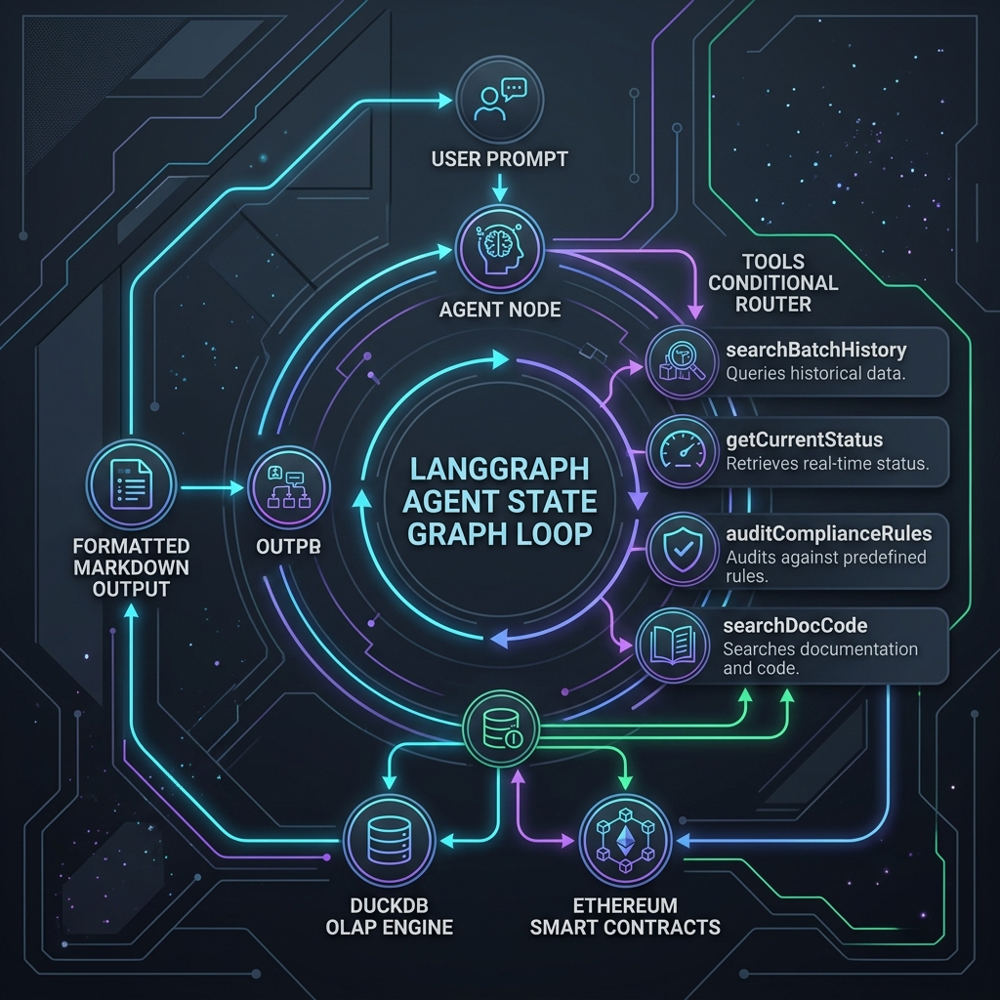
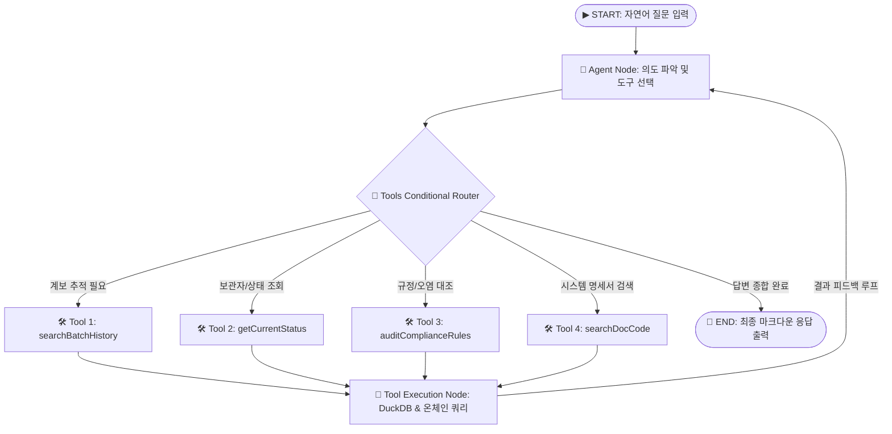

# 🤖 ChainTrace Step 6: LangGraph JS AI Agent 상태 그래프(State Graph) 설계 제안서



---

## 📌 1. 개요 (Overview)

본 설계안은 사용자의 요청에 따라 **Step 6 코드를 백지 상태에서 새로 재구성하기 위해 작성된 LangGraph JS AI Agent 상태 그래프(State Graph) 아키텍처 제안서**입니다.

ChainTrace의 블록체인 스마트 컨트랙트 및 DuckDB 고속 인덱싱 엔진 위에 **`@langchain/langgraph` 기반의 상태 그래프(State Graph)**를 구축하여, 자연어 질문 하나만으로 **원료-완제품 계보 재귀 추적**, **온체인 실시간 보관자 조회**, **규정 및 오염 대조**, **시스템 명세서 RAG 검색**을 지능적으로 분기·실행합니다.

---

## 🏗️ 2. LangGraph 상태 그래프(State Graph) 순환 아키텍처



---

## 🧩 3. LangGraph 핵심 구성 요소 및 4대 도구(Tools) 명세

### ① **Agent State (메모리 상태 제어)**
```javascript
const agentState = {
  messages: {
    value: (x, y) => x.concat(y),
    default: () => [],
  },
  targetBatchId: null,
  toolExecutions: []
};
```

### ② **4대 지능형 도구 (Core Tools)**

| 도구 이름 (Tool Name) | 역할 및 반환 정보 | 연동 엔진 |
| :--- | :--- | :--- |
| **`searchBatchHistory`** | 배치 ID 입력 시 상위 원재료 계보 및 하위 완제품 영향 범위 **DuckDB Recursive CTE 0.001초 재귀 추적** | DuckDB CTE Engine (`genealogy` 테이블) |
| **`getCurrentStatus`** | 특정 배치의 온체인 실시간 보관자(`custodian`), 최근 검사성적서 및 유효 상태(`NORMAL`, `QUARANTINED`, `RECALLED`) 조회 | Ethers.js + DuckDB (`batches`, `inspections`) |
| **`auditComplianceRules`** | 4대 규정(검사 유효기간 30d/90d, 자격정지 물류사 이관, 오염 원료 투입, 리콜 상태) 자동 대조 및 위반 리포트 생성 | Smart Contract Specs + DuckDB |
| **`searchDocCode`** | 시스템 아키텍처 명세서 및 스마트 컨트랙트 규정 명세서([`ChainTrace_SmartContracts_Spec.md`](file:///c:/apps/ChainTrace/ChainTrace_SmartContracts_Spec.md)) RAG 검색 | Markdown RAG Spec Reader |

---

## 💬 4. 웹 UI 대화 위젯 (Chat Widget) 시각화 계획

- **플로팅 대화 모달**: 모든 웹 포탈(원료사, 제조사, 검사기관, 물류사, 유통사) 화면 우측 하단에 `🤖 AI 무역원장 에이전트` 위젯 배치
- **실시간 실행 뱃지 표시**: 에이전트가 어떤 도구(`Tool 1`, `Tool 2` 등)를 실행했는지 시각적 뱃지로 표시
- **원터치 추천 질문 지원**:
  - 🔍 `RAW-SUP02-D03 오염 원료 계보 및 완제품 영향 추적해줘`
  - 📜 `FG-PACK01-D14 온체인 보관자와 성적서 상태 조회`
  - 🛡️ `스마트 컨트랙트 규정 대조`

---

## 📋 5. 승인 요청 (User Review Required)

위의 **LangGraph JS 상태 그래프 아키텍처 다이어그램 및 4대 도구 설계안**을 검토해 보시고 승인해 주시면, 이 구성을 바탕으로 순서대로 깔끔하게 코드를 작성하고 독립 테스트를 진행하겠습니다.

진행하시려면 **"진행해"**라고 응답해 주시기 바랍니다!
