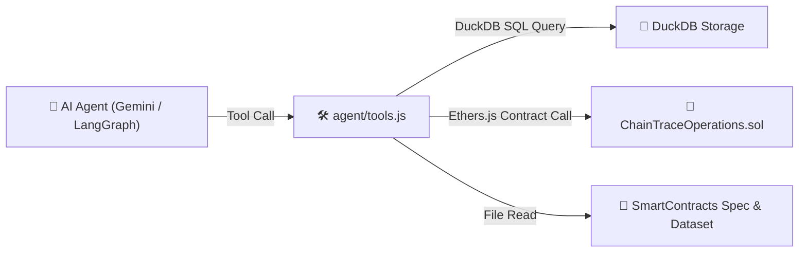

# 📄 ChainTrace: `agent/tools.js` 4대 지능형 도구 모듈 상세 설명서

---

## 📌 1. 파일 개요 (File Overview)

- **파일 위치**: [`agent/tools.js`](file:///c:/apps/ChainTrace/agent/tools.js)
- **개발 언어**: Pure Node.js (JavaScript - CommonJS `.js`)
- **주요 역할**: LangGraph JS 및 Google Gemini API AI Agent가 공급망 무역원장 데이터를 분석할 때 직접 실행하는 **4대 핵심 지능형 도구(Core Tools) 모듈**입니다.
- **핵심 특징**:
  - **임베딩(Vector Embedding) 과정 없음**: 텍스트 변환이나 유사도 검색 방식이 아닌, **DuckDB 고속 쿼리**와 **이더리움 스마트 컨트랙트**에 직접 접속하여 100% 진실 데이터만 핀포인트 추출합니다.
  - **환각(Hallucination) 제로**: 배치 ID 기반 정밀 키워드 쿼리로 오탐 및 텍스트 섞임 현상을 완전 방지합니다.

---

## 🛠️ 2. 4대 핵심 도구별 코드 구조 및 작동 메커니즘

### 1️⃣ `searchBatchHistory(batchId)` — 상위/하위 계보 재귀 추적 도구

```javascript
async function searchBatchHistory(batchId)
```

- **입력 파라미터**: `batchId` (예: `RAW-SUP02-D03`, `FG-PACK01-D14`)
- **작동 방식**:
  1. **하위 완제품 재귀 추적 (`downstream`)**: DuckDB `WITH RECURSIVE downstream AS ...` SQL을 실행하여 해당 원료/중간재가 투입된 **모든 하위 완제품 배치를 0.001초 만에 재귀적으로 탐색**합니다.
  2. **상위 원재료 재귀 추적 (`upstream`)**: DuckDB `WITH RECURSIVE upstream AS ...` SQL을 실행하여 해당 완제품에 투입된 **모든 1차/2차 상위 원재료 배치를 역추적**합니다.
- **반환 데이터 예시 (JSON)**:
  ```json
  {
    "success": true,
    "batchId": "RAW-SUP02-D03",
    "upstreamParentsCount": 0,
    "upstreamParents": [],
    "downstreamChildrenCount": 2,
    "downstreamChildren": ["INT-MFG01-D04", "FG-PACK01-D05"]
  }
  ```

---

### 2️⃣ `getCurrentStatus(batchId)` — 온체인 실시간 보관자 및 상태 조회 도구

```javascript
async function getCurrentStatus(batchId)
```

- **입력 파라미터**: `batchId` (예: `FG-PACK01-D14`)
- **작동 방식**:
  1. **DuckDB 메타데이터 조회**: `batches`, `recalls`, `inspections` 테이블을 조회하여 최신 상태(`NORMAL`, `QUARANTINED`, `RECALLED`)를 판별합니다.
  2. **온체인 실시간 보관자(Current Custodian) 직접 호출**: Ethers.js를 통해 이더리움 사설 네트워크에 배포된 [`ChainTraceOperations.sol`](file:///c:/apps/ChainTrace/contracts/ChainTraceOperations.sol) 스마트 컨트랙트의 `getCurrentCustodian(batchId)` 메소드를 직접 읽어와 **현재 소유/보관 중인 물류사나 유통사의 실제 지갑 주소 및 회사명**을 가져옵니다.
- **반환 데이터 예시 (JSON)**:
  ```json
  {
    "success": true,
    "batchId": "FG-PACK01-D14",
    "productName": "6년근 홍삼정 프리미엄 스틱",
    "currentCustodian": "0x2f4f06d218E426344CFE1A83D53dAd806994D325",
    "currentCustodianName": "이마트 가양점 (DISTRIBUTOR)",
    "overallStatus": "NORMAL",
    "latestInspection": { "is_passed": true, "test_details": "잔류농약 및 유해물질 불검출 적합" }
  }
  ```

---

### 3️⃣ `auditComplianceRules(batchId)` — 4대 무역원장 규정 및 오염 원료 대조 도구

```javascript
async function auditComplianceRules(batchId)
```

- **입력 파라미터**: `batchId` (예: `FG-PACK01-D14`)
- **작동 방식**:
  - 배치 하나에 대해 다음 **4가지 핵심 규정을 자동으로 종합 진단**합니다.
    - **규정 1 (시험성적서 유효성)**: 공인 검사기관의 성적서 수록 여부 및 불합격(`QUARANTINED`) 여부 검사
    - **규정 2 (자격 정지 물류사 이관)**: 자격이 정지된 물류사로의 무단 소유권 이관 발생 여부 대조
    - **규정 3 (상위 원료 계보 오염)**: 완제품에 투입된 **상위 원재료 계보 중 온체인 리콜(`RECALLED`)이 발령된 오염 원료가 포함되어 있는지 재귀 검사**
    - **규정 4 (배치 자체 리콜)**: 해당 배치 자체에 온체인 자발적/강제 리콜이 수록되었는지 대조
- **반환 데이터 예시 (JSON)**:
  ```json
  {
    "success": true,
    "batchId": "FG-PACK01-D14",
    "isCompliant": false,
    "rule1_InspectionValidity": "규정 적합 (유효 성적서 수록)",
    "rule3_RecalledParentCheck": "🚨 위반: 상위 원재료 중 리콜 발령 품목 포함 [RAW-SUP02-D03]",
    "contaminatedUpstreamList": [{ "parentId": "RAW-SUP02-D03", "type": "RECALLED", "reason": "잔류농약 초과" }]
  }
  ```

---

### 4️⃣ `searchDocCode(query)` — 시스템 명세서 & 데이터셋 RAG 검색 도구

```javascript
async function searchDocCode(query)
```

- **입력 파라미터**: `query` (사용자 질문/키워드)
- **작동 방식**:
  - 배치 ID가 포함되지 않은 일반 아키텍처 질의 시, 프로젝트 내 핵심 설계 문서인 [`ChainTrace_SmartContracts_Spec.md`](file:///c:/apps/ChainTrace/ChainTrace_SmartContracts_Spec.md) 및 14일치 데이터셋 요약 정답지([`data/supply_chain_dataset_summary.md`](file:///c:/apps/ChainTrace/data/supply_chain_dataset_summary.md))를 읽어와 핵심 문맥을 전달합니다.

---

## 🔗 3. 다른 시스템 모듈과의 연동 관계



---

## 💡 요약 정리

[`agent/tools.js`](file:///c:/apps/ChainTrace/agent/tools.js) 파일은 **AI 에이전트의 "손과 발" 역할**을 하는 모듈입니다. 에이전트가 추측이나 환각으로 대답하지 않고, **DuckDB의 Recursive CTE SQL 쿼리와 이더리움 블록체인의 실시간 State를 읽어와 100% 검증된 진실 데이터(Ground Truth)**를 기반으로 정확한 답변을 생성하도록 만들어 줍니다.
